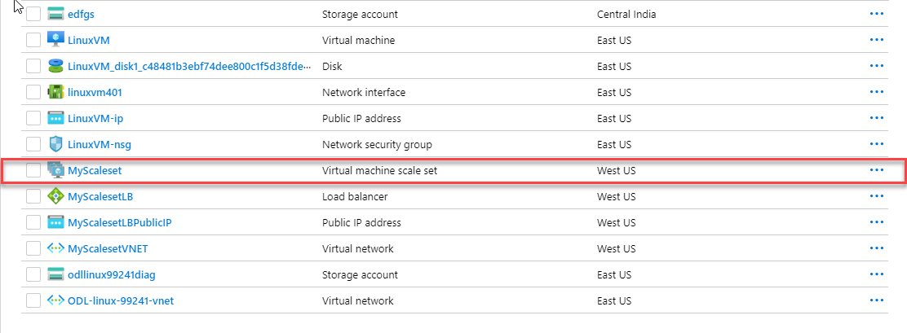
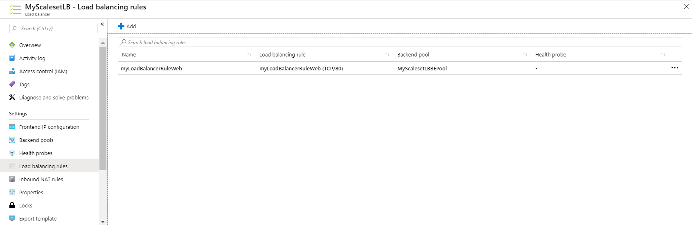
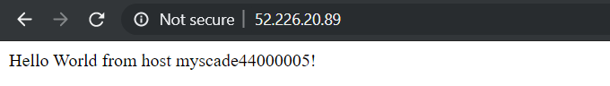

### Exercise 3: Deploy VM Scale Set

A **Virtual Machine Scale Set** allows you to deploy and manage a set of identical, auto-scaling virtual machines. You can scale the number of VMs in the scale set manually, or define rules to autoscale based on resource usage such as CPU, memory demand, or network traffic. In this exercise, you deploy a virtual machine scale set in Azure. You learn how to:<br/>

- Use **cloud-init** to create an app to scale<br/>
- Create a **Virtual Machine Scale Set**<br/>
- Increase or decrease the number of instances in a scale set<br/>

**Launch Cloud Shell**


**Create an app to scale** <br/>

We have already created a custom script that includes pre-installed **Nagix Server** with **index.js** web application .You can download that custom file using below command:-

Run On Azure Cloud Shell<br/>
```
wget https://raw.githubusercontent.com/SpektraSystems/Start-your-first-Linux-Virtual-Machine-on-Azure/master/cloud-init.yaml
```

<br/>


**Create a scale set** <br/>

1. create a virtual machine scale set with **az vmss create**. 
     --resource-group :- Enter your **Resource Group** name.
     --name :- Enter **Scale Set** name.
     --admin-username :- Enter **Admin User** name.

```
az vmss create --resource-group myResourceGroupScaleSet --name myScaleSet --image UbuntuLTS --upgrade-policy-mode automatic --custom-data cloud-init.yaml --admin-username azureuser --generate-ssh-keys
``

   <br/>
  
  2. To allow traffic to reach the web app, create a rule with **az network lb rule create**.<br/>
       --resource-group :- Enter your **Resource Group** name.
 ```
az network lb rule create --resource-group myResourceGroupScaleSet --name myLoadBalancerRuleWeb  --lb-name myScaleSetLB  --backend-pool-name myScaleSetLBBEPool  --backend-port 80  --frontend-ip-name loadBalancerFrontEnd  --frontend-port 80  --protocol tcp
  ```
  
 
   <br/>
  
  
  4. To view a list of VMs running in your scale set, use az vmss list-instances as follows:
     --resource-group :- Enter your **Resource Group** name.
     --name :- Your **Scale Set** name.
  ```
az vmss list-instances --resource-group myResourceGroupScaleSet --name myScaleSet --output table 
  ```
  
   <br/>
   
   
6.To see your Node.js app on the web, obtain the public IP address of your load balancer with **az network public-ip show**.
  --resource-group :- Enter your **Resource Group** name.
  --name :- Your **Scale Set** name.
  ```
  az network public-ip show --resource-group myResourceGroupScaleSet --name myScaleSetLBPublicIP  --query [ipAddress]  --output tsv
    
   ``` 
  5. Enter the public IP address in to a web browser. The app is displayed, including the hostname of the VM that the load balancer          distributed traffic to <br/>
  
    <br/>
