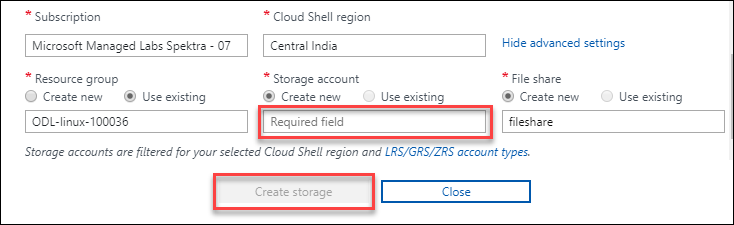

## Excerice 2:- Connect to Virtual Machine

1. Select this sign **">_"** .<br/>

   <br/>

2. Select **BASH** in cloud shell window.<br/>

3. Select **Show Advance Setting**.<br/>

4. Create a storage for Bash give **Storage Name** then click on **Create Storage**.<br/>

   <br/>
   
5.Run this command for see **Public IP** of your virtual machine<br/>.
  --resource-group :- Enter you **Resource Group** name.
  --name :- Enter your **VIrtual Machine** name.
  
  ```
  az network public-ip show --resource-group myResourceGroupScaleSet --name myScaleSetLBPublicIP  --query [ipAddress]  --output tsv
  ```
      

5. Run below command to take **SSH** of your virtual machine.
   X.X.X.X :- Enter your **Public IP**

  ```
    ssh azureuser@x.x.x.x
   
  ```
   <br/>
