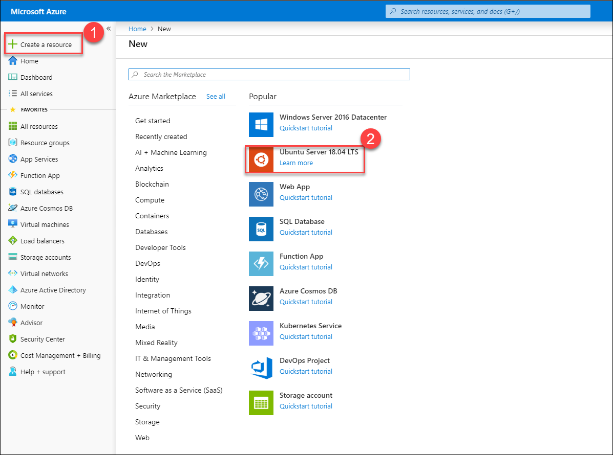
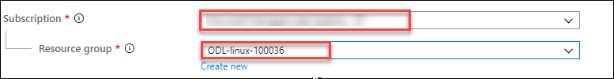
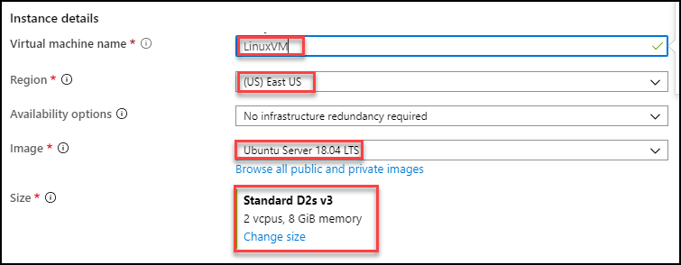
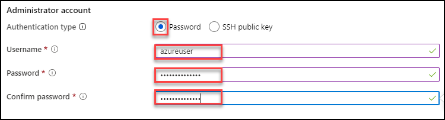
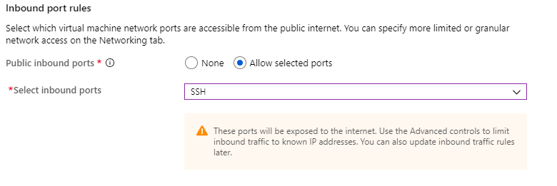
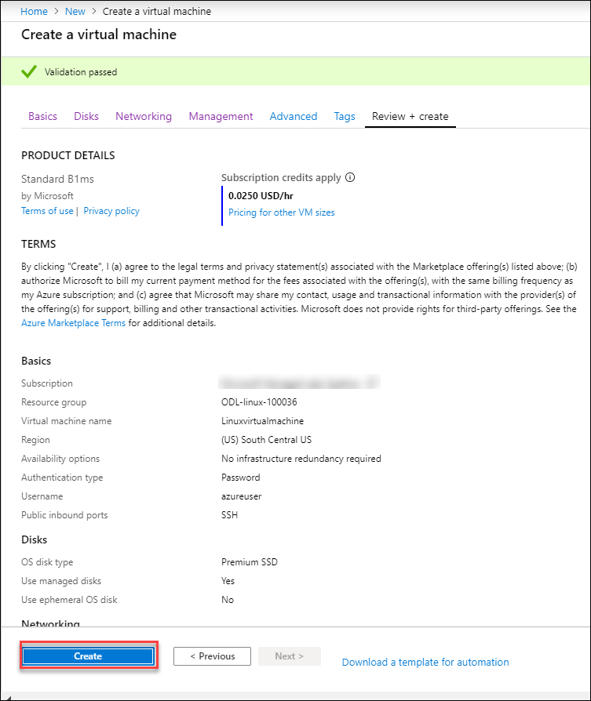
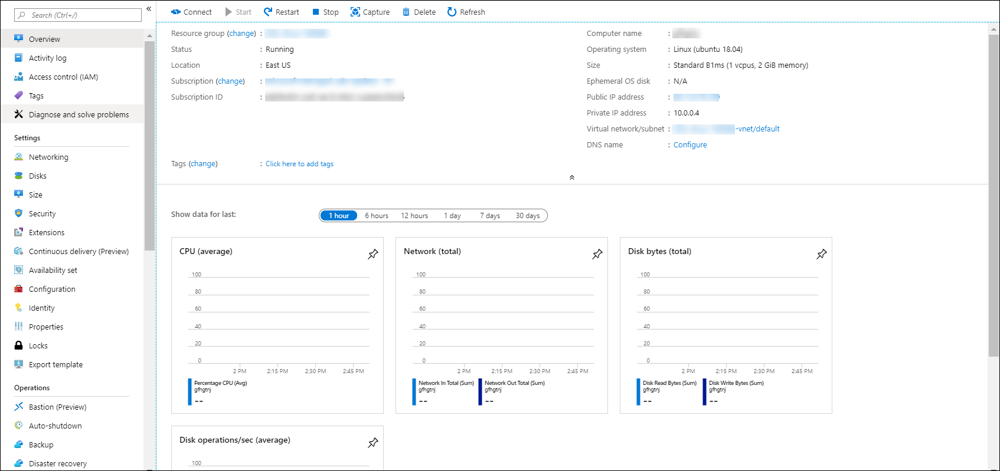

### Exercise 1: Create your first Linux VM

**Create Ubuntu VM using Portal**

1. Choose **Create a resource** in the upper left corner of the Azure portal and select **Ubuntu Server 18.04 LTS**. 

    

2. In the Basics tab, under Project details, make sure the correct **Subscription** is selected and then choose your **Resource group**. 

     

3. Under Instance details, type **Name of VM** for the Virtual machine name,choose your **Region**, image **Ubuntu Server 18.04 LTS/Ubuntu Server 16.04 LTS** and **Size**. 

      

4. Under Administrator account, select **Password**, type **User Name** and **Password**. 

      

5. Under **Inbound port** rules > Public inbound ports, choose **Allow selected ports** and then select **SSH (22)** from the drop-down. 

      

6. Leave the remaining defaults and then select the **Review + create** button at the bottom of the page. 

7. On the Create a virtual machine page, you can see the details about the VM you are about to create. When you are ready, select        **Create**. 
 
       
      
 8. After sometime you can see that your virtual machine successfully deployed.  
 
      
      

