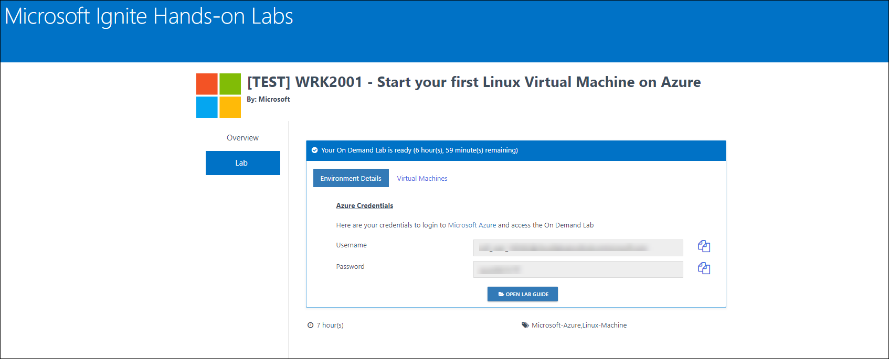

# Exercise 0: Log into your Azure Portal and Verify access to the Subscription
In this exercise, you will log into the **Azure Portal** using your Azure credentials and you will verify the type of role you are assigned in this Subscription. 
1. Click on Environment Details Tab on this Page to view your Azure Lab credentials details. Use these deatils to login into the Azure portal. 

### Login to Azure Portal 

1. **Navigate** to https://portal.azure.com and login using the credentials provided in previous step. We'd recommend using an InPrivate browser window for this. (From the previous step). 
1. **Enter** the **Username** and **click** on **Next**. 
1. On Stay signed in? pop-up window, click **No**. **Enter** the **Password** and click on **Sign in**. 
 
