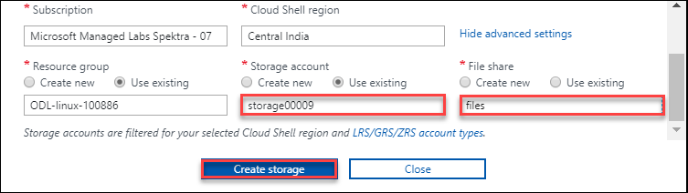
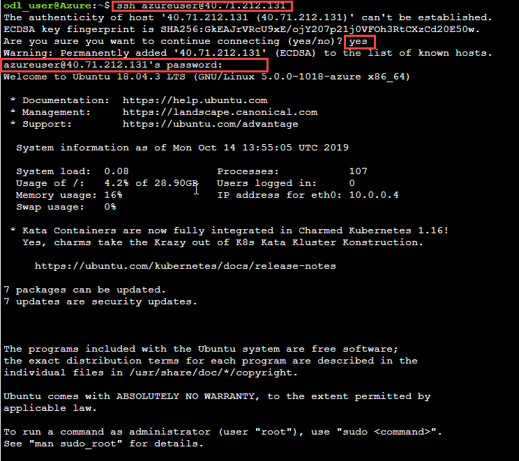
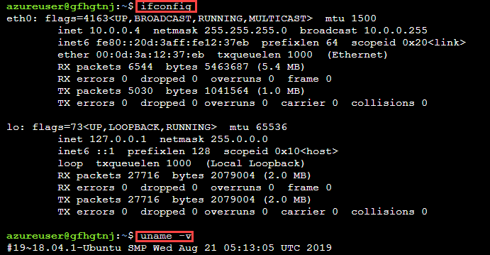

# Exercise 2: Work with CloudShell

### 2.1 Launch Cloud Shell

1. Select the **Cloud Shell** from the upper right corner of the Azure Portal. 
 
2. Select **BASH** in cloud shell window. 
3. Select **Show Advance Setting**. 
4. Create a storage accounr for Bash, provide unique name for **Storage Account**, **File share** and then click on **Create Storage**. 
 

### 2.2 Get Public IP of Virtual Machine Using Azure CLI

1. Run following command to get **Public IP** of your virtual machine. 
  * g :- Enter you **Resource Group** name. 
  * n :- Enter  your **Virtual Machine** name. 
``
az vm show -d -g ODL-linux-XXXX -n VMname --query publicIps -o tsv
``

### 2.3 SSH to VM using Public IP

1. Run below command to take **SSH** of your virtual machine. 
  * x.x.x.x :- Replace this with your virtual machine **Public IP**. 
``
ssh azureuser@x.x.x.x
`` 
 

### 2.4 Perform Basic Operation Inside Virtual Machine

1. Run the following commands for the basic operations: 
 

### 2.5 Access Serial Console of Virtual Machine

1. For using serial console of Ubuntu virtual machine navigate to the **Resource Group->Virtual Machine->Overview->Support + Troubleshooting->Serial Console**. 
 
