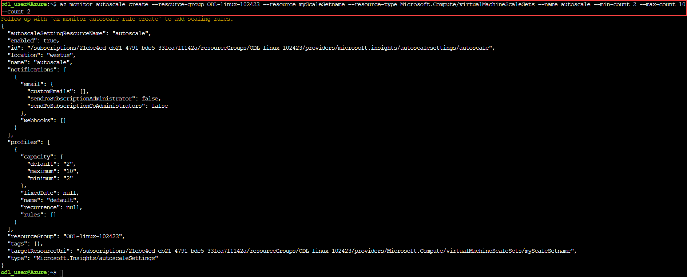
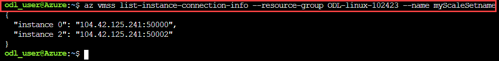
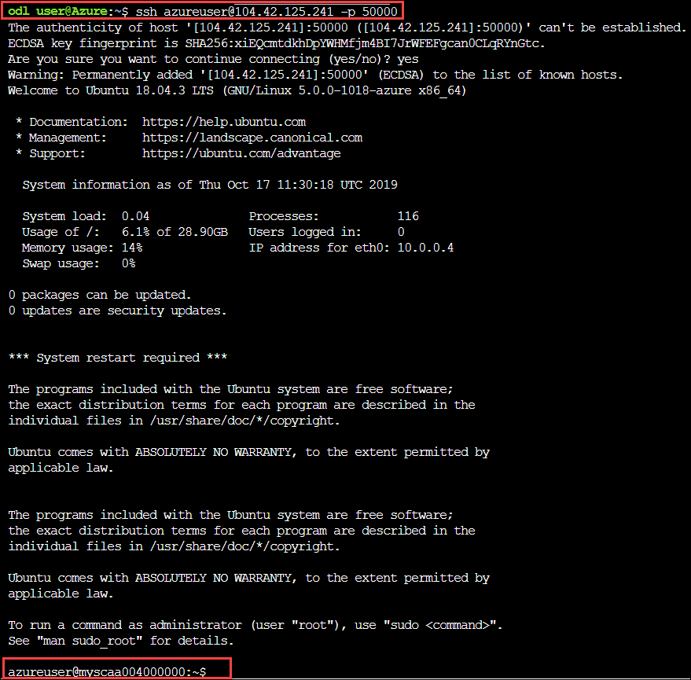
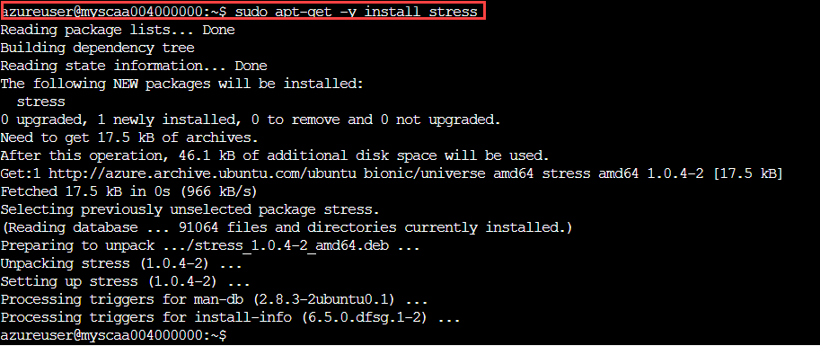
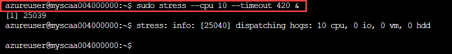
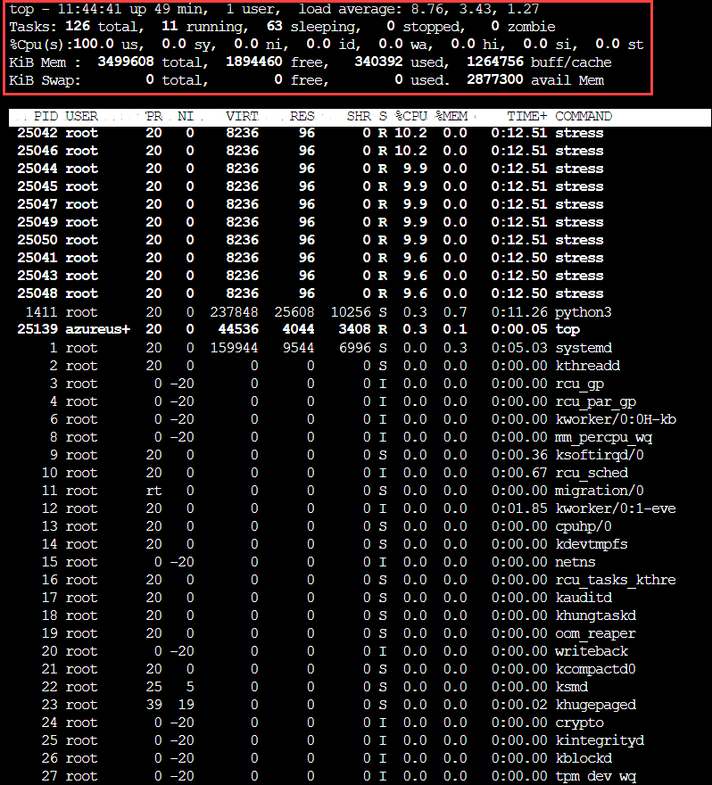
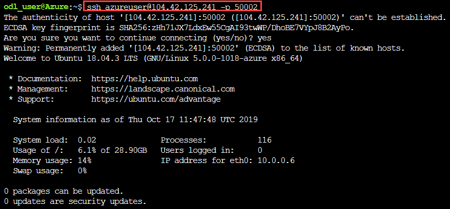
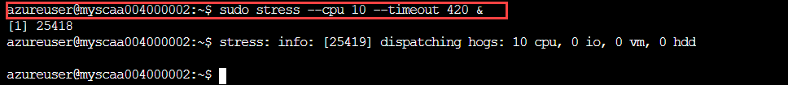

# Exercise 3: Deploy VM Scale Set

A **Virtual Machine Scale Set** allows you to deploy and manage a set of identical, auto-scaling virtual machines. You can scale the number of VMs in the scale set manually, or define rules to autoscale based on resource usage such as CPU, memory demand, or network traffic. In this exercise, you deploy a virtual machine scale set in Azure. You learn how to: 
* Use **cloud-init** to create an app to scale 
* Create a **Virtual Machine Scale Set** 

#### 3.1 Launch Cloud Shell

1. Select the **Cloud Shell** icon from the upper right corner of the Azure Portal. 
 
2. Select **BASH** from drop down in cloud shell window. 
3. Use your existing bash storage account which we provisioned in **Exercise 2**. 

#### 3.2 Create an App to Scale

1. We have already created a custom script that includes pre-installed **Nginx Server** with **index.js** web application. Copy the below command and paste in cloud shell for downloading the custom file: 
``
wget https://raw.githubusercontent.com/SpektraSystems/Start-your-first-Linux-Virtual-Machine-on-Azure/master/cloud-init.yaml
``

 

#### 3.3 Create a Scale Set

1. Create a virtual machine scale set using **az vmss create** command. This will automatically deploy required resorces such as a Pulic IP, Loadbalancer, Loadbalancing rules, Backend Pools, etc. 
 * resource-group :- Enter your **Resource Group** name. 
 * name :- Enter **Scale Set** name. 
 * admin-username :- Enter **Admin User** name. 
``
az vmss create --resource-group ODL-linux-XXXX --name myScaleSet --image UbuntuLTS --upgrade-policy-mode automatic --custom-data cloud-init.yaml --admin-username azureuser --generate-ssh-keys
``

 
2. Navigate to **Azure portal** go to **Resourse Group->Load Balancer**. Copy the name of **Load Balancer** and **Backend Pools** for next step. 
 
3. To allow traffic to reach the web app, create a rule with **az network lb rule create** command. Please provide the following values for running the below command: 
 * resource-group :- Enter your **Resource Group** name. 
 * name  :- Enter name for **Load Balancer Rule**. 
 * lb-name :- Enter your **Load Balancer** name that you copied in previous step. 
 * backend-pool :- Enter your **Backend Pool** name that you copied in previous step. 
``
az network lb rule create --resource-group ODL-linux-XXXX --name myLoadBalancerRuleWeb --lb-name myScaleSetlb --backend-pool-name myScaleSetLBBEPool --backend-port 80 --frontend-ip-name loadBalancerFrontEnd --frontend-port 80 --protocol tcp
``

 
4. To view a list of VMs running in your scale set, use **az vmss list-instances** command. Please provide the following values while running the below command: 
 * resource-group :- Enter your **Resource Group** name. 
 * name :- Your **Scale Set** name. 
``
az vmss list-instances --resource-group ODL-linux-XXXX --name myScaleSet --output table
``

 
5. To see your Node.js app on the web, obtain the public IP address of your load balancer with **az network public-ip show** command.  Please provide the following values while running the below command: 
 * resource-group :- Enter your **Resource Group** name. 
 * name :- Your **Scale Set** name. 
``
az network public-ip show --resource-group ODL-linux-XXXX --name myScaleSetLBPublicIP  --query [ipAddress]  --output tsv
``

 
6. Enter the public IP address in to a web browser. The app is displayed, including the hostname of the VM that the load balancer distributed traffic to. 
 

#### 3.4 Define an autoscale profile

1. To create autosacle in scaleset use **az monitor autoscale create**. Please provide the following values while running the below command: 
 * resource-group :- Enter your **Resource Group** name. 
 * resource :- Enter your **ScaleSet** name. 
 * -name :- Enter any **AutoScale** name. 
``
az monitor autoscale create --resource-group ODL-linux-XXXX --resource myScaleSet --resource-type Microsoft.Compute/virtualMachineScaleSets --name autoscale --min-count 2 --max-count 10 --count 2
``
 
2.To create a rule with az monitor autoscale rule create that increases the number of VM instances in a scale set when the average CPU load is greater than 70% over a 5-minute period use the below command. Please provide the following values while running the below command: 
 * resource-group :- Enter your **Resource Group** name. 
 * autoscale-name :- Enter your **autoscale-name** name. 
``
 
az monitor autoscale rule create --resource-group ODL-linux-XXXX --autoscale-name autoscale --condition "Percentage CPU > 70 avg 5m" --scale out 3
``
 
3. To Create another rule with az monitor autoscale rule create that decreases the number of VM instances in a scale set when the average CPU load then drops below 30% over a 5-minute period us below command. Please provide the following values while running the below command: 
 * resource-group :- Enter your **Resource Group** name. 
 * autoscale-name :- Enter your **autoscale-name** name. 
``
az monitor autoscale rule create --resource-group ODL-linux-XXXX --autoscale-name autoscale --condition "Percentage CPU < 30 avg 5m" --scale in 1
``
 
#### 3.5 Generate CPU load on scale set

1. To see list the address and ports to connect to VM instances in a scale set use **az vmss list-instance-connection-info**. Please provide the following values while running the below command: 
 * resource-group :- Enter your **Resource Group** name. 
 * name :- Enter your **ScaleSet** name. 
 ``az vmss list-instance-connection-info --resource-group ODL-linux-XXXX --name myScaleSet
``
 
2.SSH to your first VM instance. Specify your own public IP address and port number with the -p parameter, as shown from the below command: 
 * X.X.X.X :- Enter your **Public IP**
``ssh azureuser@X.X.X.X -p 50000
``
 
3. Once logged in, install the stress utility. Start 10 stress workers that generate CPU load. These workers run for 420 seconds, which is enough to cause the autoscale rules to implement the desired action. 
``sudo apt-get -y install stress
sudo stress --cpu 10 --timeout 420 &
``
 
 
4. To confirm that stress generates CPU load, examine the active system load with the top utility: 
``top  
``
 
5. Exit top, then close your connection to the VM instance. stress continues to run on the VM instance. 
``Ctrl-c
exit
``
6. Connect to second VM instance with the port number listed from the previous **az vmss list-instance-connection-info**: 
``ssh azureuser@13.92.224.66 -p 50003
``
 
7.Install and run stress, then start ten workers on this second VM instance. 
``sudo apt-get -y install stress
sudo stress --cpu 10 --timeout 420 &
``
 
 
8. Close your connection to the second VM instance type **exit**. stress continues to run on the VM instance. 
9.To monitor the number of VM instances in your scale set, use watch. It takes 5 minutes for the autoscale rules to begin the scale-out process in response to the CPU load generated by stress on each of the VM instances: 
``watch az vmss list-instances --resource-group ODL-linux-XXXX --name myScaleSet --output table
``

