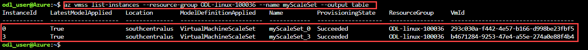
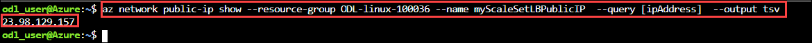

Exercise 3: Deploy VM Scale Set
-------------------------------

A **Virtual Machine Scale Set** allows you to deploy and manage a set of identical, auto-scaling virtual machines. You can scale the number of VMs in the scale set manually, or define rules to autoscale based on resource usage such as CPU, memory demand, or network traffic. In this exercise, you deploy a virtual machine scale set in Azure. You learn how to:<br/>

- Use **cloud-init** to create an app to scale<br/>
- Create a **Virtual Machine Scale Set**<br/>
- Increase or decrease the number of instances in a scale set<br/>

**3.1 Launch Cloud Shell**

1. Select the **Cloud Shell** icon from the upper right corner of the Azure Portal. .<br/>

   <br/>

2. Select **BASH** from drop down in cloud shell window.<br/>


**3.2 Create an app to scale** <br/>

1. We have already created a custom script that includes pre-installed **Nagix Server** with **index.js** web application. You              can download that custom file using below command:- <br/>

Run On Azure Cloud Shell<br/>
```
wget https://raw.githubusercontent.com/SpektraSystems/Start-your-first-Linux-Virtual-Machine-on-Azure/master/cloud-init.yaml
```

   <br/>


**3.3 Create a scale set** <br/>

1.  Create a virtual machine scale set using **az vmss create** command. This will automatically deploy a pulic IP, Load                     balancer, Loadbalancing rules, Backend pools etc.. <br/>
      - Please provide the following values while running the below command :<br/>
         - resource-group :- Enter your **Resource Group** name.
         - name :- Enter **Scale Set** name.
         - admin-username :- **azureuser**.

```
az vmss create --resource-group ODL-linux-XXXX --name myScaleSetname --image UbuntuLTS --upgrade-policy-mode automatic --custom-data cloud-init.yaml --admin-username azureuser --generate-ssh-keys
```

   <br/>   

  
 2.  To allow traffic to reach the web app, create a rule with **az network lb rule create** command. Navigate to your resource              group and provide the values for Load balancer name, Backend pool name and Front-end Ip in the below command. <br/>
      - Please provide the following values while running the below command :<br/>
         - resource-group   :- Enter your **Resource Group** name.<br/>
         - name             :- Enter **Load Balancer New Rule**  name.<br/>
         - lb-name          :- Enter your **Load Balancer** name.<br/><br/>
         - backend-pool     :- Enter your **Backend Pool** name.<br/>
         - frontend-ip-name :- Enter your **Frontend IP** name. <br/>
     
 ```
az network lb rule create --resource-group <ODL-linux-XXXX> --name myLoadBalancerRuleWeb  --lb-name <loadbalancer-name>  --backend-pool-name <Backend-pool-Name>  --backend-port 80  --frontend-ip-name <loadBalancerFrontEndip>  --frontend-port 80  --protocol tcp
  ```
  
   <br/>
   
  
3. To view a list of VMs running in your scale set, use **az vmss list-instances** command.<br/>
     - Please provide the following values while running the below command :<br/>
         - resource-group :- Enter your **Resource Group** name.<br/>
         - name :- Your **Scale Set** name.<br/>
  ```
az vmss list-instances --resource-group ODL-linux-XXXX --name myScaleSetname --output table 
  ```
  
   <br/>
   
   
4. To see your Node.js app on the web, obtain the public IP address of your load balancer with **az network public-ip show** command.<br/>
      - Please provide the following values while running the below command :<br/>
          - resource-group :- Enter your **Resource Group** name.<br/>
           - name :- Your **Scale Set** name.<br/>
  ```
  az network public-ip show --resource-group ODL-linux-XXXX --name myScaleSetLBPublicIP  --query [ipAddress]  --output tsv
  ``` 
   
   <br/
   
   
5. Enter the public IP address in to a web browser. The app is displayed, including the hostname of the VM that the load balancer          distributed traffic to <br/>
  
    <br/>
     
     
--------------------------------------------------------------------
