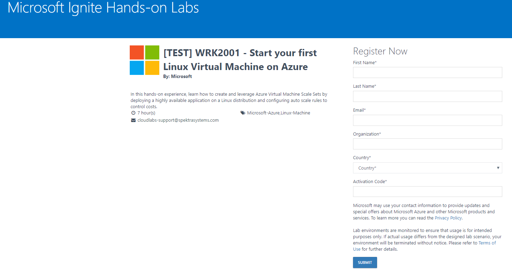
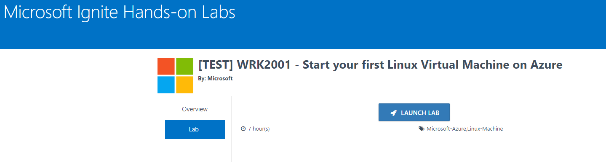
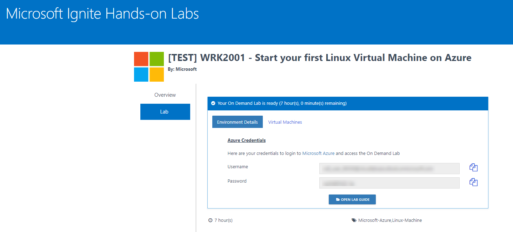
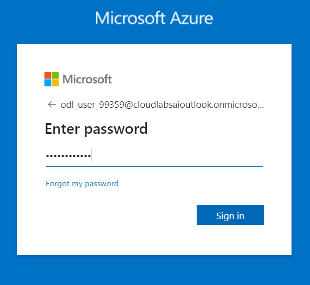
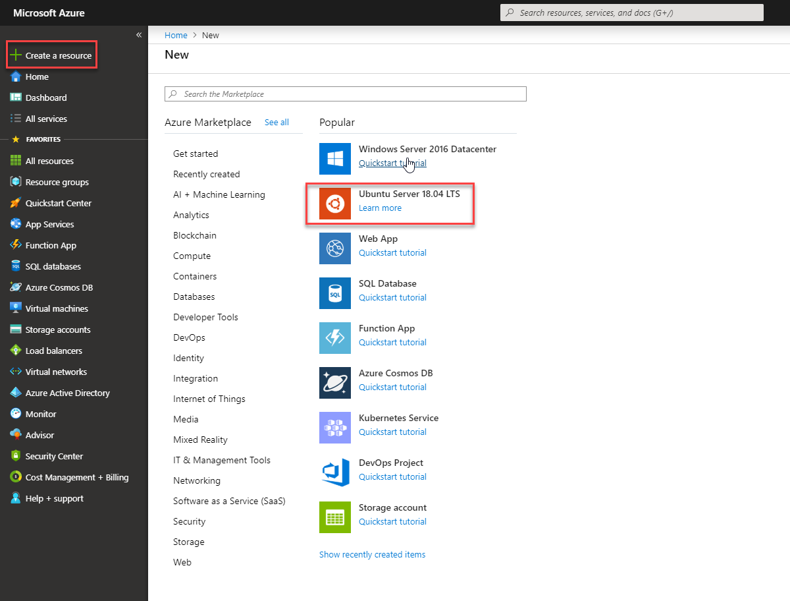
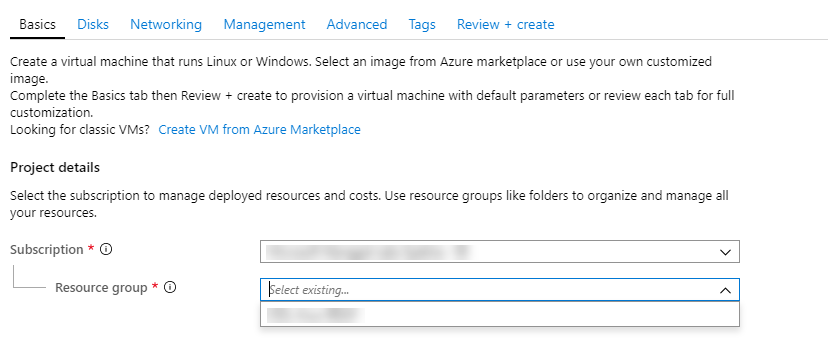
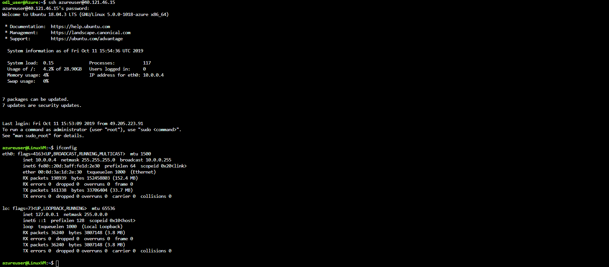

### Lab Overview
 In this lab you learn how to create Linux Machine using Azure Portal. You configure Virtual Machine Scale Set.


### Exercise 1: Sign Up for pre configured environment

In this exercise, you will create a source environment.
1.	**Navigate** to bitly link which was provided by instructor and register by providing all required information and **clicking** on **SUBMIT button**.<br/>

<br/>

2. Once registration is accepted, you will be automatically redirected to the lab activation page. Now, it is advised to save a copy of the URL on the browser, which has the activation id. **Click** on the **Launch Lab** button.<br/>

<br/>

3. You will see the environment details soon below.<br/>

<br/>

Please ensure to take the values assigned to your deployment.

### Exercise 2: Log into your Azure Portal and Verify access to the Subscription

In this exercise, you will log into the **Azure Portal** using your Azure credentials and you will verify the type of role you are assigned in this Subscription.

1.  **Navigate** to https://portal.azure.com and login (from the previous step).

2.  **Enter** the **Username** which was displayed in the previous window and **click** on **Next**.<br/>

<br/>

3.	In the Stay signed in? pop-up window, click **No**. **Enter** the **Password** and click on **Sign in**.<br/>

<br/>

### Exercise 3: Create a Linux virtual machine in the Azure portal


**Create virtual machine**

1. Choose **Create a resource** in the upper left corner of the Azure portal and select **Ubuntu Server 18.04 LTS**.<br/>

<br/>
2. In the Basics tab, under Project details, make sure the correct **Subscription** is selected and then choose your **Resource group**.<br/>

<br/>
3. Under Instance details, type **Name of VM** for the Virtual machine name and choose East US for your Region. Leave the other            defaults.<br/>

<br/>

4. Under Administrator account, select **Password**, type your **User Name** or **Password**.<br/>

<br/>

5. Under **Inbound port** rules > Public inbound ports, choose Allow selected ports and then select **SSH (22)** from the drop-down.<br/>

<br/>

6. Leave the remaining defaults and then select the **Review + create** button at the bottom of the page.<br/>

7. On the Create a virtual machine page, you can see the details about the VM you are about to create. When you are ready, select        **Create**.<br/>

8. Connect to virtual machine<br/>
  
  * Run this command in Azure Bash<br/>
  ```
    ssh azureuser@YourPublicIP
   
  ```
<br/>


### Exercise 3: Create a virtual machine scale set and deploy a highly available app on Linux with the Azure CLI

A **Virtual Machine Scale Set** allows you to deploy and manage a set of identical, auto-scaling virtual machines. You can scale the number of VMs in the scale set manually, or define rules to autoscale based on resource usage such as CPU, memory demand, or network traffic. In this exercise, you deploy a virtual machine scale set in Azure. You learn how to:<br/>

- Use **cloud-init** to create an app to scale<br/>
- Create a **Virtual Machine Scale Set**<br/>
- Increase or decrease the number of instances in a scale set<br/>


**Create an app to scale** <br/>

For production use, we have already created a custom VM image that includes pre-installed application .You can download that custom file using below command:-

Run On Azure Bash<br/>

**wget https://github.com/SpektraSystems/Start-your-first-Linux-Virtual-Machine-on-Azure/blob/master/cloudinit1.txt**


<br/>


**Create a scale set** <br/>

1. create a virtual machine scale set with az vmss create<br/>. 

```
az vmss create --resource-group YourResourceGroupName --name NameofYourScaleset --image UbuntuLTS --upgrade-policy-mode automatic --custom-data cloud-init.txt --admin-username azureuser --generate-ssh-keys 
```
<br/>
  
  2. To allow traffic to reach the web app, create a rule with az network lb rule create.<br/>
 ```
az network lb rule create --resource-group YourResourceGroup --name myLoadBalancerRuleWeb  --lb-name myScaleSetLB  --backend-pool-name myScaleSetLBBEPool  --backend-port 80  --frontend-ip-name loadBalancerFrontEnd  --frontend-port 80  --protocol tcp
  ```
  <br/>
  
  
  4. To view a list of VMs running in your scale set, use az vmss list-instances as follows:
  ```
az vmss list-instances --resource-group myResourceGroupScaleSet --name myScaleSet --output table 
  ```
  <br/>
  
  5. Enter the public IP address in to a web browser. The app is displayed, including the hostname of the VM that the load balancer          distributed traffic to <br/>
  
   <br/>
   
   
  
  
 
  


